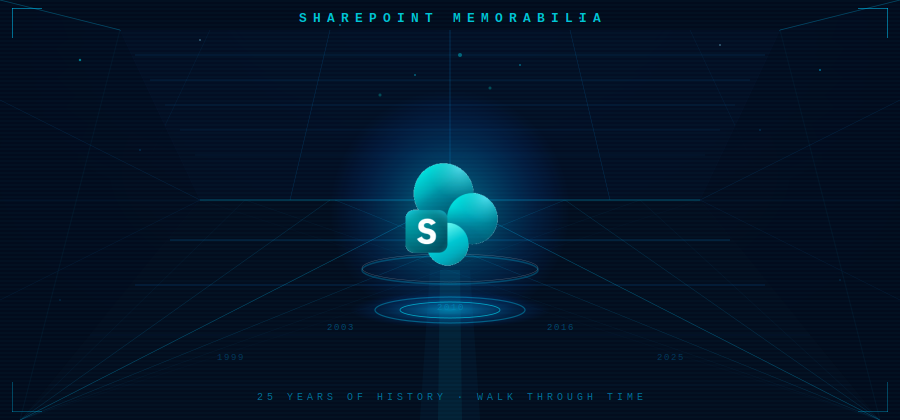

# SPat25 — SharePoint Memorabilia

> **Live:** https://www.scoutman.pt/spat25-spmemorabilia/

  

  <em>🕹️ Walk through 25 years of SharePoint history — one room at a time!</em>

---

A first-person 3D experience  taking you on a walk through the history of SharePoint : from the early Tahoe days in 1999 all the way to the modern Microsoft 365 era.

---

## What is this?

SharePoint Memorabilia is an interactive museum where each room represents a major SharePoint release. Step through portals to travel across the years, explore era-themed environments, read period headlines on screens and posters, and collect keys to unlock new areas.

### Rooms / Eras covered

| Room | Version | Year |
|------|---------|------|
| Tahoe | SharePoint Tahoe | 1999 |
| SP 2001 | SharePoint Portal Server 2001 | 2001 |
| SP 2003 | SharePoint Portal Server / WSS 2003 | 2003 |
| SP 2007 (MOSS) | Microsoft Office SharePoint Server 2007 | 2007 |
| SP 2010 | SharePoint Server 2010 | 2010 |
| SP 2013–2019 Hall | SharePoint 2013 · 2016 · 2019 | 2013–2019 |
| Dome Lab | SharePoint Subscription Edition / Online | Present |

Each room features:
- Era-themed architecture and lighting
- Product UI screens and conference posters
- World headlines and cultural touchstones from that year
- Puzzles and collectibles to progress

---

## Controls

| Key | Action |
|-----|--------|
| Click | Enter / pointer lock |
| WASD | Move |
| Space | Jump |
| Mouse | Look |
| E | Interact |
| Esc | Release pointer |

---

## Work in Progress

> This project is **actively under development**. Content, rooms, and puzzles will continue to be expanded.
>
> A major content update is planned **after the M365 Community Conference (April 2026)**, bringing new rooms, updated era screens, and additional memorabilia.

